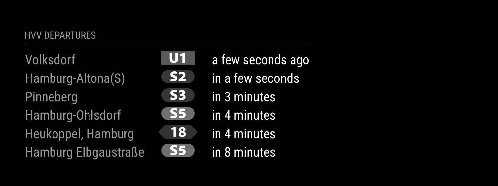

# MMM-HVV 🚇

MagicMirror Module that displays departure information about public transportation in Hamburg, Germany. ~~It uses [`v5.hvv.transport.rest`](https://v5.hvv.transport.rest/) (also see [hvv-rest](https://github.com/derhuerst/hvv-rest)).~~

### Update

`hvv-rest` was deprecated. Even though I'm not personally using MagicMirror anymore, I updated the endpoint to [`db-rest`](https://v6.db.transport.rest/) to make this module somewhat working again but I'm not planning to implement anything new. But feel to contribute your ideas!



## Installation

Clone this module into your MagicMirror's `modules` directory:

```sh
cd modules
git clone https://github.com/lucoel/MMM-HVV
```

## How to use this module

Add this to your MagicMirror `config.js` file:

```javascript
{
  /* ...your other config */
  modules: [
    {
      module: "MMM-HVV",
      position: "bottom_left",
      config: {
        station: Number
      }
    }
  ];
}
```

### Find your station/stop ID

The REST API can [`GET /locations`](https://v6.db.transport.rest/).

### Example

```sh
curl 'https://v6.db.transport.rest/locations?query=Feldstraße,Hamburg&results=1' -s | jq
```

```jsonc
[
  {
    "type": "station",
    "id": "694779",
    "name": "Feldstraße (Heiligengeistfeld), Hamburg",
    "location": {
      "type": "location",
      "id": "694779",
      "latitude": 53.556976,
      "longitude": 9.968714
    },
    "products": {
      // …
    }
  }
]
```

With this method you can also search for the (optional) direction ID.

## Configuration options

| Option                 | Description                                                  | Default        |
| ---------------------- | ------------------------------------------------------------ | -------------- |
| `station` **required** | The station/stop ID where you want to start                  | undefined      |
| `destination`          | Only show departures for a specific direction/destination ID | undefined      |
| `maxDepartureTime`     | Maximum time until departure in minutes                      | `20`           |
| `showIcons`            | Show line icons for every departure                          | `true`         |
| `header`               | Custom header text                                           | HVV Departures |
